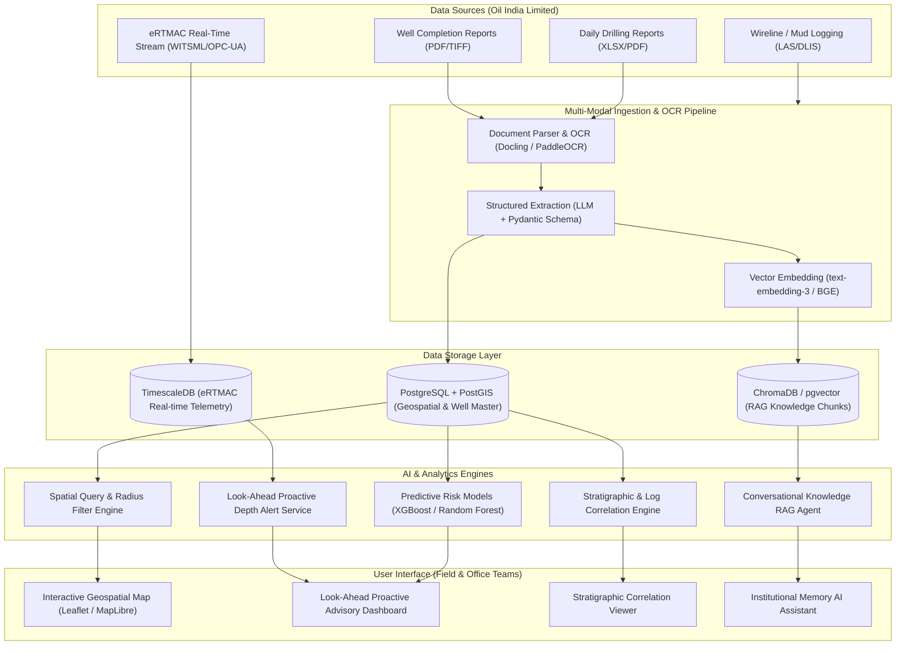

# WISDOM — Well Intelligence & Drilling Operations Memory
## An AI-Powered Offset Well Knowledge and Decision Support Platform for Oil India Limited (OIL)
*(eRTMAC-NWIS Problem Statement Solution)*

---

## 1. Executive Summary & Project Vision

During drilling operations in geologically challenging environments (such as the Upper Assam basin, Digboi, Naharkatiya, Moran, and Kusijan fields), drilling engineers must make critical decisions within minutes to prevent catastrophic Non-Productive Time (NPT) events—such as **lost circulation, differential stuck pipe, overpressure kicks, wellbore collapse, and drill bit premature failures**.

While Oil India Limited's **eRTMAC** provides real-time surface/downhole sensor feeds from the active rig, critical institutional memory remains locked inside hundreds of legacy **Well Completion Reports (WCRs), Daily Drilling Reports (DDRs), Mud Logging Sheets, and post-well reviews (PDFs and scans)**.

**WISDOM (Well Intelligence & Drilling Operations Memory)** bridges this gap as an **AI-powered institutional memory and decision-support co-pilot** that:
1. Geospatially maps and queries offset wells within a dynamic radius.
2. Ingests and extracts unstructured drilling reports via OCR and LLMs into a structured knowledge base.
3. Dynamically aligns stratigraphic horizons and logs between the active well and nearby wells.
4. Predicts drilling risks ahead of the bit using machine learning ensemble models.
5. Issues **Proactive Look-Ahead Depth Alerts** (e.g., *"At 2,910m, offset well NHK-108 suffered severe mud loss of 85 bbls/hr in Barail Coal-Shale. Recommended mud weight: 11.7 ppg with 25 ppb LCM"*).
6. Provides an interactive RAG AI assistant grounded in verified Oil India documentation.

---

## 2. System Architecture & High-Level Flow

---

## 3. Detailed Technology Stack

| Layer | Recommended Technology | Justification |
| :--- | :--- | :--- |
| **Frontend UI / UX** | Vanilla JS / CSS3 + React / Next.js / Vite, Leaflet.js, Chart.js, Lucide Icons | Ultra-fast rendering, zero lag during real-time telemetry streaming, rich interactive maps, and responsive dark-mode styling tailored for drilling command centers. |
| **Backend API** | Python (FastAPI + Uvicorn) | Asynchronous high-throughput REST API with native WebSocket support for streaming eRTMAC live drilling depth and parameter alerts. |
| **Geospatial Database** | PostgreSQL + PostGIS | Enterprise spatial indexing (`ST_DWithin`, `ST_Distance`, `ST_Transform`) to instantly compute offset well distances, azimuths, and spatial clusters. |
| **Time-Series Telemetry** | TimescaleDB / InfluxDB | Optimized for continuous logging of depth-based and time-based drilling parameters (ROP, WOB, Torque, Mud Density, Pit Volume). |
| **Document Ingestion & OCR** | Docling / PaddleOCR / LayoutLMv3 | State-of-the-art optical character recognition capable of reading scanned tables, mud logging logs, and multi-column legacy reports. |
| **Vector Database (RAG)** | pgvector / ChromaDB / Milvus | Semantic search over historical NPT cases, fishing procedures, casing programs, and post-well operational reviews with sub-second retrieval. |
| **AI / LLM Orchestration** | LangChain / LlamaIndex + Gemini 1.5 Pro / GPT-4o / Mistral | Robust multi-turn reasoning, JSON structured outputs, and citation grounding to eliminate hallucinations in safety-critical drilling decisions. |
| **Predictive Risk ML** | XGBoost, Scikit-learn, PyTorch | Classification & regression models for Mud Loss Probability, Differential Sticking Index, and Kick Influx Probability based on formation, offset mud weight, and depth. |

---

## 4. Phased Implementation Roadmap

### Phase 1: Ingestion & Knowledge Base Creation (Weeks 1-3)
- Define standard JSON schema for well master, formation tops, casing programs, mud parameters, and NPT incidents.
- Build OCR pipeline to batch-process legacy WCRs and DDRs.
- Store structured data in PostGIS and semantic text chunks in pgvector/ChromaDB.

### Phase 2: Geospatial & Stratigraphic Correlation Engine (Weeks 4-5)
- Implement PostGIS spatial queries for user-defined offset radius (e.g., 1km to 25km).
- Build the dynamic depth/TVD normalization engine to align formation tops (Girujan, Tipam, Barail, Kopili) across structural fault blocks.
- Generate side-by-side well log visualizers (Gamma Ray, Resistivity, Mud Weight).

### Phase 3: AI Predictive Risk Modeling & Look-Ahead Alerting (Weeks 6-8)
- Train machine learning models on historical failure modes (lost circulation, stuck pipe, kicks).
- Build the Look-Ahead proximity window monitor (alerts triggered when active bit depth is within $\pm 150\text{ m}$ of historical offset failure points).
- Synthesize proactive operational SOPs and mitigation checklists.

### Phase 4: Conversational RAG & Decision Support Assistant (Weeks 9-10)
- Integrate retrieval-augmented generation (RAG) with verified document citations.
- Implement specialized prompt templates for drilling engineering queries (stuck pipe freeing, LCM pill design, casing setting depths).

### Phase 5: Field Integration & eRTMAC Streaming (Weeks 11-12)
- Connect real-time WITSML / OPC-UA feeds from active drilling rigs.
- Deploy testing at Oil India Duliajan / Naharkatiya operations center.
